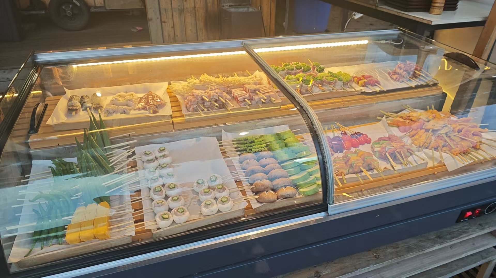
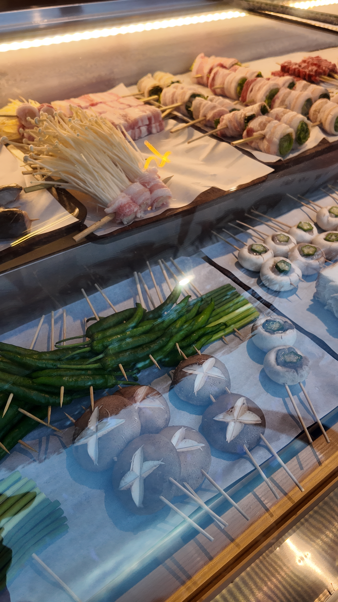

# 小红书完整照片版发布预览

状态：待用户确认，未发布

主题：湖边晚霞＋当天现串现用的烧鸟

## 图片顺序

1. `微信图片_20260902152200_277_9.jpg`
   - 竖版橙色晚霞与湖面倒影，视觉冲击最强，作为首图。
   - 建议保持完整原图，不加重滤镜。
   - 可选封面字：`长沙湖边烧鸟｜晚霞落进晚餐里`

2. `微信图片_20260829231249_225_9.jpg`
   - 完整展示柜，能看到荤串、菌菇和蔬菜串，支撑“食材新鲜、当天现串现用”。

3. `DJI_20260901183826_0012_D.JPG`
   - 食材近景，能看到肉卷、金针菇、秋葵和香菇等真实串品细节。
   - 作为“当天准备、当天现串现用”的近距离画面证据。

未收入本次推送的顾客照片中，人物面部较清楚；没有确认肖像授权前不应提交或发布。

## 推荐标题

长沙湖边烧鸟｜晚霞落进晚餐里

## 备选标题

1. 在长沙，吹着湖风吃现串烧鸟
2. 湖边晚霞配烧鸟，这顿饭可以慢慢吃
3. 把烧鸟店开在湖边后，傍晚成了彩蛋
4. 长沙晚餐新选择：湖景、晚霞和现串烧鸟
5. 等一场湖边晚霞，再慢慢吃几串

## 正文

把烧鸟店开在湖边以后，最期待的就是傍晚。

天色慢慢变橘，晚霞落在湖面上，桌边的灯也一点点亮起来。这样的晚餐，不用赶时间，坐下来吹吹湖风就很舒服。

展示柜里的食材当天准备、当天现串现用。荤串、菌菇和蔬菜一盘盘摆好，柜里有什么就拍什么，不需要把颜色修得特别夸张。

好天气和晚霞不是每天都有，但遇上的时候，确实值得早点来坐一会儿。看天色从橙色慢慢变蓝，再开始吃串，湖边的晚餐也多了一点松弛感。

想看当天菜单和位置，可以私信问我。

## 话题

#长沙美食 #长沙烧鸟 #长沙晚霞 #湖边晚餐 #湖边烧鸟 #长沙夜生活

## 背景音乐

首选候选：`晚风心里吹－王赫野`

理由：旋律与湖风、晚霞和慢节奏晚餐的画面一致，适合照片自动播放，不需要强卡点。

发布前要求：在小红书App音乐库内搜索并确认该版本仍可用。若不可用，搜索“晚风”“落日”“治愈纯音乐”或“轻爵士”，选择平台可用、前奏舒缓的音乐，重新给用户确认。

## 发布设置建议

- 类型：小红书图片笔记。
- 图片数量：3张。
- 首图：晚霞竖图，不使用展示柜横图作为首图。
- 地点：只有门店正式定位核对无误后再添加。
- 价格：本版不写，当前没有已核验价目表。
- 时间：不写“今天”“今日晚霞”，文件名不能证明实际拍摄日期。
- 发布状态：未获得用户“确认发布”，不得发布。
