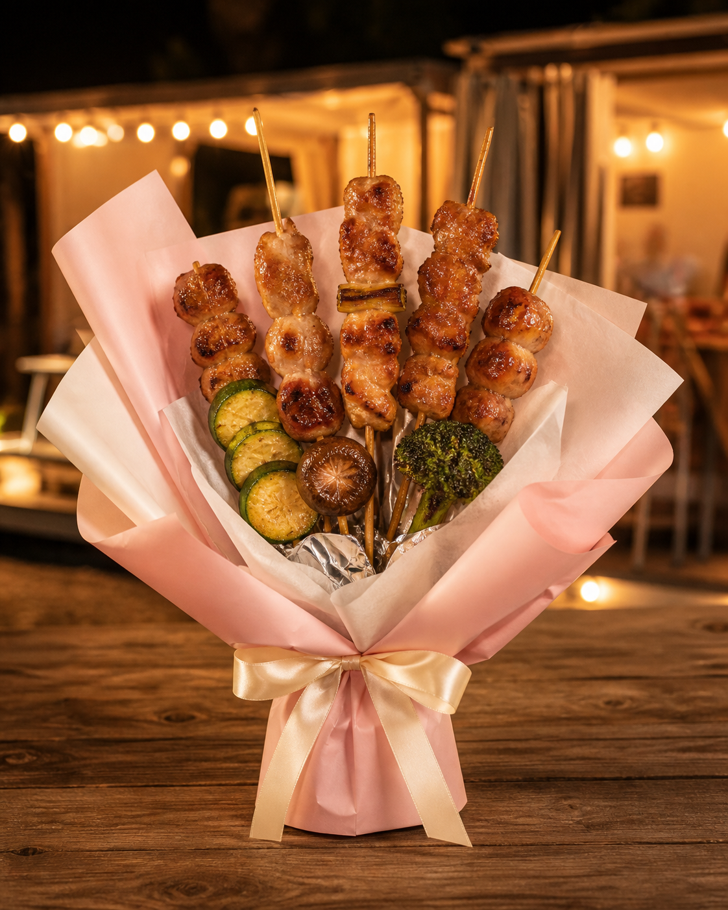
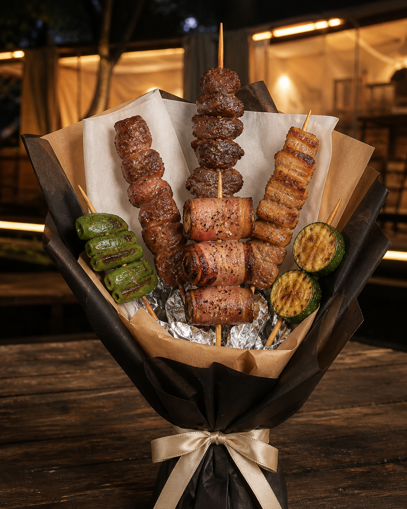
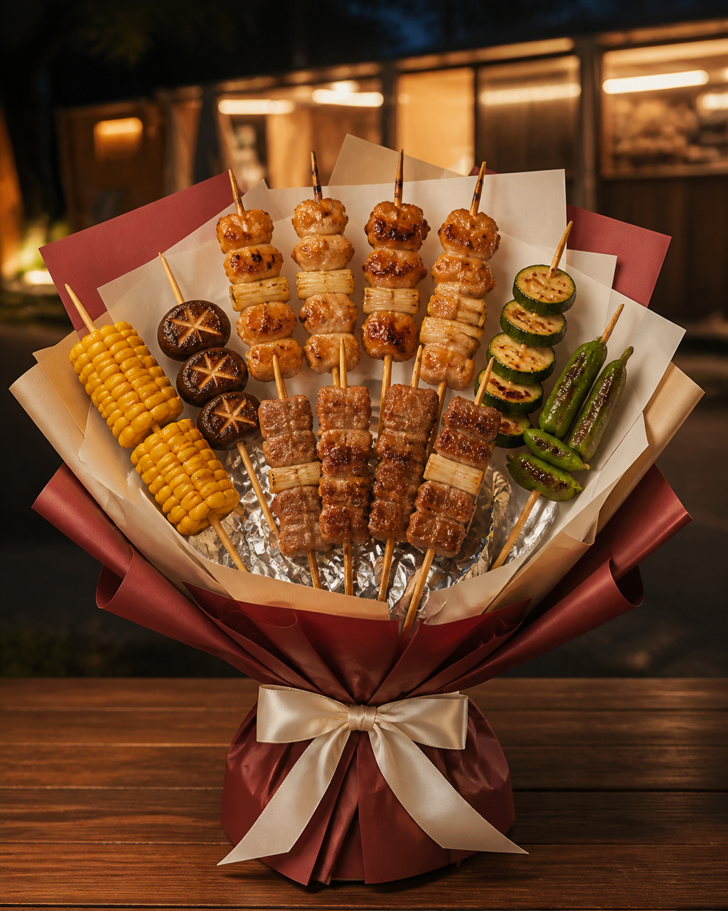
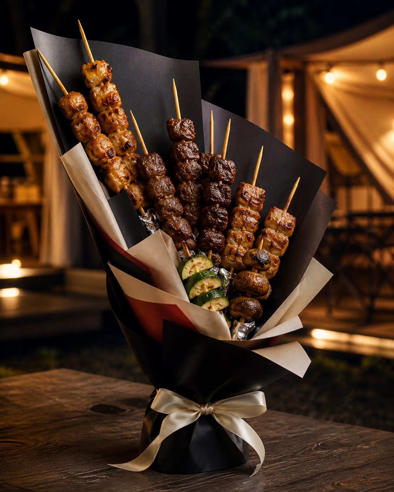

# 游味烧鸟｜烧鸟花首轮四款概念设计

## 使用边界

- 本轮依据门店生串照片生成，熟串色泽和形态暂按常见烧鸟效果估算，等实拍熟串后再校准。
- 成图用于确认审美、轮廓和包装方向；串品的准确数量以本文配方为准，不能按生成图逐根数。
- 当前未确认任何鲜花、叶材或仿真花库存，所以四款均为“无鲜花烧鸟花束”。蔬菜串承担轻质、色彩和边缘过渡作用。
- 以下售价是按门店串品零售价加包装与制作服务得出的首轮测试价。包装耗材成本、人工时间和损耗尚未实测，不是最终定价。

## 共用安全结构

1. 将黑色花束模型底座放稳，裁切花泥作为内部承重芯。
2. 花泥必须用完整食品级袋或食品级膜封闭，不能裸露、掉屑。
3. 按设计角度预埋食品级PP套管或食品级粗吸管；实际串签只插入套管，不能直接插花泥。
4. 食材下方设置独立锡纸隔离圈，避免油汁流入包装和底座。
5. 重串靠近底座中心，轻串和蔬菜串放在外沿；多点分散受力，不要把重串挤在同一孔位。
6. 包装纸只负责造型和遮挡，不能代替底座承重。
7. 成品完成后进行静置、轻晃、提走和转身测试；出现下滑或倾倒就缩短串签或加宽底座。

---

## 01｜心动粉烤｜女生、情侣款

### 设计逻辑

- 花型：柔和、不完全对称的单面半圆。
- 焦点：鸡肉串集中在中部，蔬菜串从下方向边缘过渡。
- 层次：后排高、中排密、前排低，至少三个高度和三个深度。
- 配色：樱花粉约60%，奶白约30%，奶茶色及食材色约10%。

### 准确备料

| 类别 | 数量 | 门店金额 |
|---|---:|---:|
| 鸡肉串 | 6串 | 52.8元 |
| 素菜串 | 3串 | 24元 |
| 串品小计 | 9串 | 76.8元 |

包装：樱花粉韩素纸2—3层、奶白纸1—2层、奶茶纸1小层、锡纸、乳白丝带、黑色模型底座。

建议首轮测试售价：**128元**。

### 制作顺序

1. 先插中后方3支较高鸡肉串，建立柔和三角骨架。
2. 在中部补入3支鸡肉串，组成一个密集主焦点，但高度不要齐平。
3. 将3支蔬菜串放在左下、右下和前侧，形成颜色重复和视觉路径。
4. 正面检查不能成为一排平面，侧面必须看得见前、中、后距离。
5. 奶白纸贴近食材区，樱花粉做外轮廓，奶茶纸只露少量边缘。
6. 收腰后系乳白丝带，蝴蝶结尺寸不要超过花束宽度的三分之一。

### 产品寓意

当前没有真实花材，所以这不是传统花语。品牌创意寓意为：**温柔不是没有火，而是把热烈包得刚刚好。**

### 文案

- 产品Slogan：**花会谢，喜欢要趁热。**
- 小红书标题：`长沙居然有可以吃的烧鸟花束｜约会礼物不只送花`
- 短文案：`樱花粉包住炭火香，九支上上签送给今天最想见的人。吃得到的浪漫，来自游味烧鸟。`

---

## 02｜硬派有肉｜男友、丈夫、兄弟款

### 设计逻辑

- 花型：直立、不对称三角形。
- 焦点：深色牛肉集中在中下部，猪肉形成第二层体积。
- 留白：顶部串与串之间要有间隔，不能堆成肉墙。
- 配色：黑墨色约60%，牛皮纸约30%，奶白和绿色约10%。

### 准确备料

| 类别 | 数量 | 门店金额 |
|---|---:|---:|
| 牛肉串 | 3串 | 54元 |
| 猪肉串 | 3串 | 36元 |
| 素菜串 | 2串 | 16元 |
| 串品小计 | 8串 | 106元 |

包装：黑墨色欧雅纸2—3层、牛皮纸1—2层、奶白纸1小层、锡纸、乳白丝带、黑色模型底座。

建议首轮测试售价：**168元**。

### 制作顺序

1. 以1支牛肉串定最高点，左右各插1支略低肉串，先搭三角骨架。
2. 把其余牛肉和猪肉安排在中下部，重串靠中心、短串靠前。
3. 两支蔬菜串分别放在左右低位，不要放到最高处抢主体。
4. 黑纸做大轮廓，牛皮纸露出约三分之一，奶白只负责食物与黑纸之间的明度过渡。
5. 收腰要窄，外轮廓向上，避免做成圆滚滚的传统礼品篮。

### 产品寓意

品牌创意寓意：**不送虚的，心意和肉都要有分量。**

### 文案

- 产品Slogan：**兄弟之间，直接来一束肉。**
- 小红书标题：`男生真的会喜欢的花束，里面没有一朵花`
- 抖音开场：`给男朋友送花怕他不懂？那就送一束他吃得懂的。`

---

## 03｜满席常安｜父母、长辈款

### 设计逻辑

- 花型：低重心扇形，稳定、饱满、正面观赏。
- 焦点：鸡肉和猪肉集中在中下部，玉米、菌菇、瓜类在两侧形成节奏。
- 配色：低纯度海棠红约55%，奶茶色约30%，奶白和食材色约15%。
- 注意：不使用亮正红和大面积金色，避免传统廉价礼篮感。

### 准确备料

| 类别 | 数量 | 门店金额 |
|---|---:|---:|
| 鸡肉串 | 4串 | 35.2元 |
| 猪肉串 | 3串 | 36元 |
| 素菜串 | 3串 | 24元 |
| 串品小计 | 10串 | 95.2元 |

包装：海棠红韩素纸2—3层、奶茶纸2层、奶白纸1层、少量牛皮纸、锡纸、乳白丝带、黑色模型底座。

建议首轮测试售价：**158元**。

### 制作顺序

1. 中后方插4支鸡肉串，形成扇形的最高骨架，避免完全等高。
2. 3支猪肉串插在中下方，形成温暖、稳重的焦点块。
3. 3支不同颜色蔬菜串从中心向左右展开，边缘比中心更轻、更疏。
4. 从正面看要饱满，从侧面看不能是一张薄片；最重的串不得向外伸得过远。
5. 海棠红只做低纯度大轮廓，奶茶色负责柔化，奶白纸靠近食材。

### 产品寓意

品牌创意寓意：**把牵挂串成一束，愿一家人常坐一桌、常吃一餐。**

### 文案

- 产品Slogan：**有你等我回家，每一餐都是团圆。**
- 小红书标题：`送爸妈的花最后总会枯，这一束可以全家一起吃`
- 卡片文案：`愿往后的日子，桌上有热饭，身边有家人，平安常在。`

---

## 04｜夜游上上签｜纪念日、重要客户、高端礼赠款

### 设计逻辑

- 花型：现代不对称斜线式，不做常规圆扇。
- 焦点：深色牛肉位于中部偏下，鸡肉沿斜线重复，蔬菜只做小面积轻点缀。
- 平衡：左上长线较轻，右下密集深色区负责压住视觉和物理重心。
- 配色：黑墨色约55%，奶白约25%，奶茶约15%，海棠红约5%。

### 准确备料

| 类别 | 数量 | 门店金额 |
|---|---:|---:|
| 牛肉串 | 4串 | 72元 |
| 鸡肉串 | 4串 | 35.2元 |
| 猪肉串 | 2串 | 24元 |
| 素菜串 | 2串 | 16元 |
| 串品小计 | 12串 | 147.2元 |

包装：黑墨色欧雅纸3层、奶白纸1—2层、奶茶纸1层、海棠红窄条1层、锡纸、乳白丝带、加重黑色模型底座。

建议首轮测试售价：**238元**。

### 制作顺序

1. 先确定左上斜线：用2支较轻鸡肉串建立最高和次高点。
2. 在中部偏下集中4支牛肉串，形成深色主焦点，保持前后错落。
3. 其余鸡肉和猪肉沿左上到右下方向重复，但不要平均排开。
4. 两支蔬菜串放在焦点下方和外沿，面积控制在整体可见食材的约10%。
5. 黑纸建立长斜轮廓，奶白纸切出留白，海棠红只露一条窄边作为记忆点。
6. 做提走和转身测试；若左上摆动明显，缩短最高串或给底座加配重。

### 产品寓意

品牌创意寓意：**每一签都有去处，今晚所有的好意都指向你。**

### 文案

- 产品Slogan：**今晚的风、湖边的光和这一束上上签，都给你。**
- 小红书标题：`湖边烧鸟店做了一束黑色上上签，送花第一次这么有食欲`
- 抖音开场：`别人纪念日送花，我们把湖边的晚风和十二支烧鸟包成了一束。`

---

## 下一轮实拍需要记录

每款至少做一个低成本结构样，不必先用正式熟串。需要记录：正面、侧面、俯视、手持比例、底座尺寸、最高和最宽尺寸、制作时长、提走后是否变形、包装耗材成本。熟串拍摄时再记录真实颜色、油汁量和放置后的状态，用来修正第二轮效果图与最终售价。
