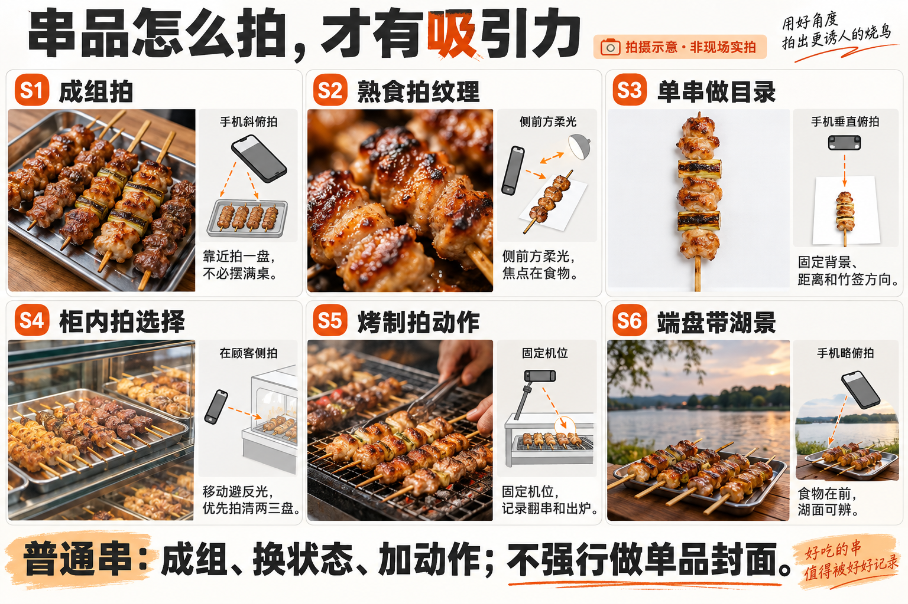
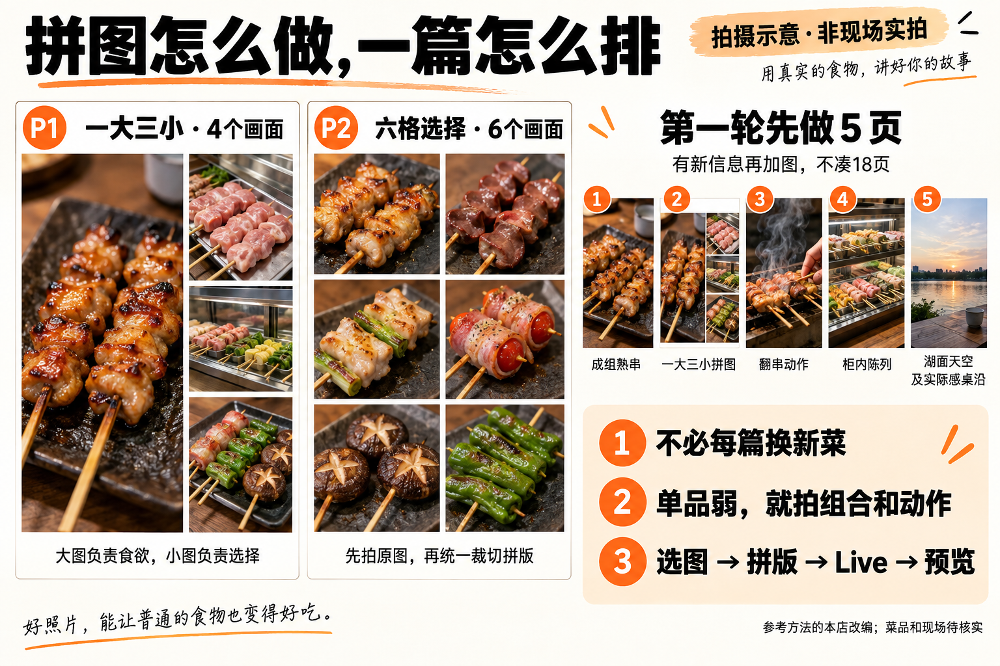
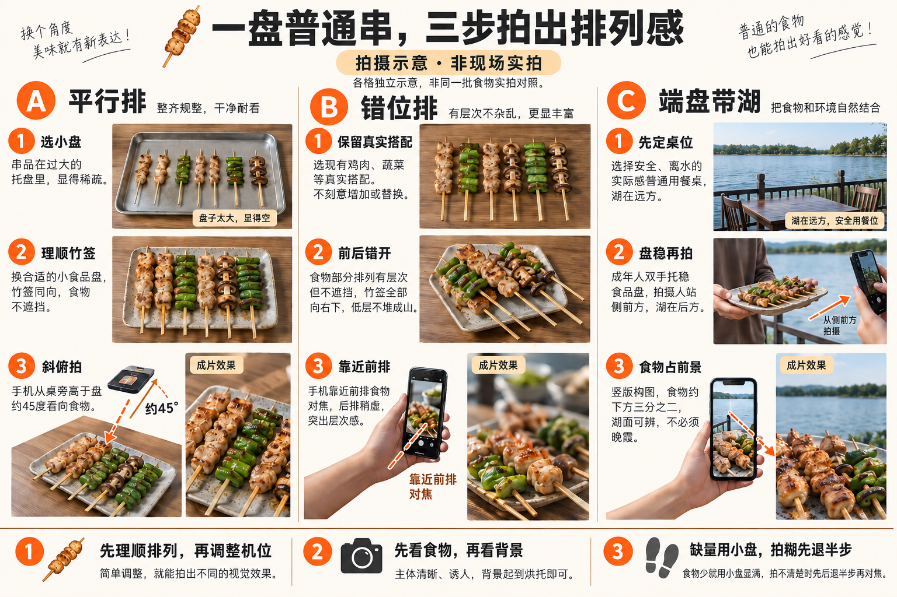
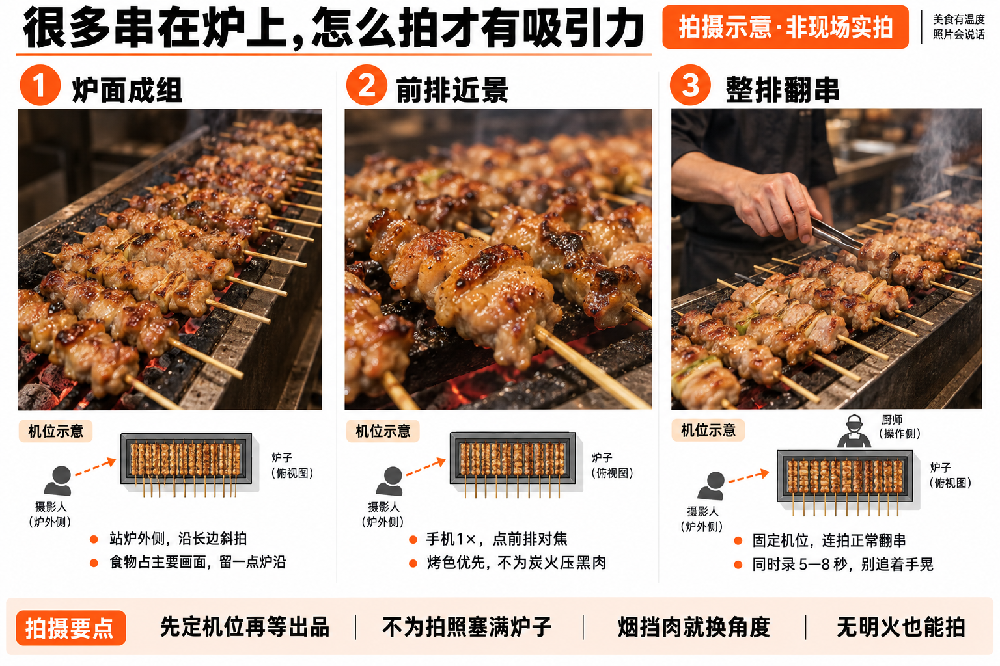
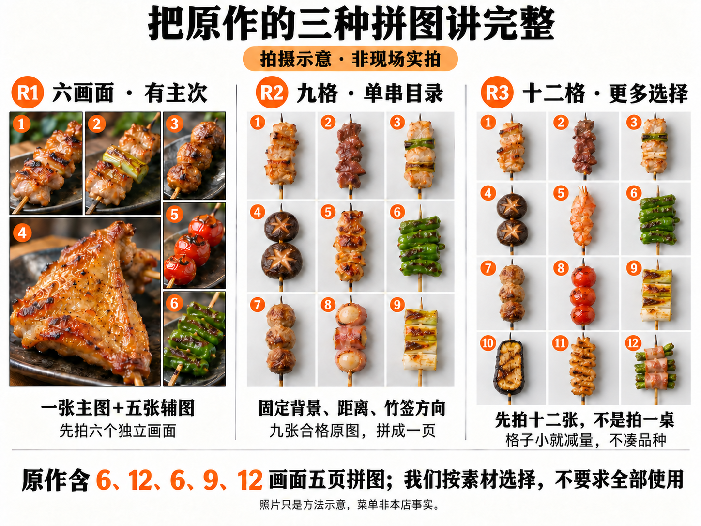

# 参考账号拍法：员工拍摄与文案教学

[项目主记录与18页观察](../../README.md) · [串品怎么拍](05_串品拍摄方法_v1.png) · [拼图怎么做](06_拼图与发布顺序_v1.png) · [原作品](https://www.xiaohongshu.com/explore/6a75905c00000000210237a7)

本页是拍摄与文案教学的唯一执行来源。参考叶帅气🍢古法烧鸟《广州柠檬叶烤鸡翅》已逐页看完的18页；不代表其所有作品或真实幕后流程。灯具、手机型号、调色和Live制作来源未知。以下机位、张数、拼图尺寸及本店文案是我们的可执行改编，效果待试拍验证。负责人待老板确认；下一步在下次内容制作前按当日条件拍一批，日期待确认。

## 教学图入口

两张均由内置imagegen生成，明显标注“拍摄示意·非现场实拍”。只教构图，不作为本店商品或空间证据。05图S4生成了熟串展示效果，**本店仍按真实生串冷柜操作，柜型与摆放以原02冰箱教学和现场为准，不能照图把熟串当冷柜库存**。06图P2画的是同类近景六格，适合学习格数与裁切；要复刻对方白底单串目录，按S3的白底单串方法拍。两者不可混称完全复刻。图里的菜品、配料、灯具、台面、晚霞与临湖距离均为创意假设，现场核实；不要求实现示意中的菜单和天气。

## 他的方法，我们学哪些

原作5页拼图分别含6、12、6、9、12个画面；其中6画面的主次拼图与白底单串目录承担不同作用。原作数量不当作其账号平均值，也不是我们每篇的最低要求。

| 观看任务 | 原作方法 | 本店怎么改 |
|---|---|---|
| 先产生食欲 | 熟鸡翅大近景、金黄表皮 | 最好的熟食或成组串品做封面；普通单串不强行当主角 |
| 想继续挑 | 主次拼图、单串目录、蔬菜拼图 | 第一轮一大三小；素材足够再用六格选择图 |
| 看清商品 | 单盘近景、生串搭配、整柜 | 以真实托盘和两三盘局部展示形态与选择 |
| 留下记忆 | 多次回到鸡翅 | 可以回到组合、动作或湖边场景，不必固定招牌菜 |
| 想来体验 | 正文点明城市、菜品并提问 | 食物先吸引，最后用实际湖面与桌位交代湖边吃串 |

成组、熟食、单串目录、柜内、烤制、湖景六组素材可以轮换使用，不要求每篇六组齐全。没有单品优势时，优先数量排列、颜色组合、正常烤制动作与湖边端盘。

## 先分清：完整学习与第一轮任务量

完整学习覆盖原作的熟食大特写、单盘生串搭配、整柜、主次拼图、单串目录、蔬菜托盘拼图和重复强化；下文5页只是用于讲解的一种试拍示例，不是固定交付量。不是只学五种东西，也不是每次照抄一个排列。原作详细18页观察保留在项目主记录，下面把每类变成操作。

| 原作页 | 要学的具体拍法 | 本页对应操作 | 本店条件不足时 |
|---|---|---|---|
| 1、7、16—18 | 同款熟食，完整排盘、两只小盘、表皮近景反复变化 | S2＋下方距离与角度试拍 | 没有突出单品，改S1成组；不强行拍五张弱特写 |
| 2 | 六画面主次拼图，1大5小 | R1原作布局 | 先用P1一大三小，明确是改编 |
| 3、12 | 生串组合与主料/配料并置 | S1错位排；配料只取真实做法所用 | 没有该搭配就拍本店真实组合，不加纯装饰假配料 |
| 4 | 整柜可选品种与托盘秩序 | S4；原02冰箱教学 | 只拍半柜或两三盘 |
| 5、8、9 | 12格、9格、12格白底单串目录 | S3＋R2/R3 | 不够品种做4/6格；不拍满桌凑丰富 |
| 6 | 六个蔬菜托盘画面拼成一页 | S1逐盘拍＋P2六格 | 品类不足时改真实备料合集，名称随内容改 |
| 10、15 | 其他熟食单盘与手持出品 | S2/S6去掉湖背景仍能使用 | 没有海鲜也无需补同款，用现有出品 |
| 11、13、14 | 多色蔬菜斜排、重复搭配、肉卷沿盘周边排列 | 下方平行/错位/沿边三种摆法 | 选符合实际串品形态的一种，不为模仿改变菜品 |

## 从一盘串到成片：具体做一遍

07图各格是独立生成的摆法示意，不是同一批食物实拍前后对照；不能通过图格间的数量或菜品差异推导效果。现场练习保持同一批真实商品，用换盘和移动机位比较。

准备同一批6串作练习即可，6是示例不是必须份量；两种实际品类有则搭配，没有就同一种。道具先用店内小食品盘、干净食品垫纸与可用桌面；生熟使用各自器具。手机与食物都不悬在热源或水边。

| 步骤 | 操作到什么程度 | 看屏幕怎么判断 |
|---|---|---|
| 1 选盘 | 先看大盘是否露出大片空底；空得明显就换能容纳实际串品的小盘 | 食物能成为主体，仍可看见少量盘沿；不能靠拍摄角度把小份暗示成套餐份量 |
| 2 理签 | 先统一签尾方向，再把食物部分理顺；避免竹签交叉盖住主菜 | 一眼能分辨每串，不是一堆竹签 |
| 3 选一种排列 | 平行排：两排方向相同；错位排：后排略向侧边移，露出食物；沿边排：长签尾向盘心，食物沿边排列 | 沿边法只适合串长与盘形匹配时，签乱就回到平行排；不要堆高遮食物 |
| 4 转盘找光 | 手机先不动，盘每次转一点，比较食物正面、侧面亮度 | 能看见纹理且没有大片白亮反射的位置保留；不要求统一某个曝光数值 |
| 5 拍全貌 | 普通模式1×、竖3:4，手机从桌边斜俯约45°；先从约一臂距离看构图再慢慢靠近 | 完整食物和少量盘边，画外杂物退出；距离依手机能否对焦调整 |
| 6 拍细节 | 保持菜和盘不动，手机靠近前排或改变角度，点前排食物对焦 | 若对焦模糊先退一点；不要用大倍率数码变焦补细节 |
| 7 拍状态 | 由员工按真实出品流程夹起或端起，摄影人固定位置 | 串、夹具和手相接自然，动作没挡住主菜 |
| 8 当场验收 | 放大看一张全貌、一张细节和一张动作，合格再撤盘 | 糊、反光、裁断当场重拍；不交几十张同构图让后期猜 |

### 同一盘必须比较的三个机位

| 机位 | 怎么摆手机 | 适用 | 放弃信号 |
|---|---|---|---|
| 正上方俯拍 | 镜头面与桌面平行，网格对齐盘边，手与手机影子避开食物 | 单串目录、规则平铺、配料组合 | 立体食物被压扁、签与肉重叠难辨 |
| 斜俯约45° | 站桌旁，镜头同时看到食物顶部和一点侧面 | 一盘排列、鸡翅等熟食、托盘组合 | 后排完全被前排遮住，或桌面比食物更抢眼 |
| 较低的侧前方 | 降低手机但仍略高于食物，点前排对焦 | 表面纹理、夹起一串、湖景端盘 | 只看见签尾、湖光把食物压黑、后排糊成一片 |

不要求三种都发布。拍完由Skill对照选最有效的一张，记录为什么选；手机、灯光不同，角度不是成功保证。

### 拍坏了怎么改，先改现场哪一步

| 画面问题 | 先做的一个调整 | 再看什么 |
|---|---|---|
| 一盘很空、食物很小 | 换小盘或靠近取景 | 食物是否占主要画面，不增加虚假数量 |
| 食物平、没有质感 | 从正上方改斜俯，光从侧前方来 | 表面明暗是否能看清，不能只增加饱和度 |
| 亮得像塑料 | 移动盘与光的角度，避免正面强反射 | 肉纹与焦边仍保留，不把亮度压到看不清 |
| 照片黄绿偏色 | 避开混合灯源，先在同一光线下重拍一张 | 白底不明显偏色，食物接近眼前所见 |
| 柜玻璃盖满灯影 | 摄影人向左/右移，试局部机位 | 反光退出主盘；不要默认长开柜 |
| 湖好看、串黑了 | 侧移避开太阳直对镜头；再用白纸在画外反光 | 食物先清楚，仍不行就分拍湖景与食物 |
| 拼图每格看不清 | 先减格，不锐化硬救 | 缩成手机宽度仍可识别商品 |
| 单串怎么拍都普通 | 改成组、状态或选择图 | 能否形成排列、动作或搭配的新信息；仍弱就不当封面 |

## 现场执行：S1—S6

共同准备：两人配合；一人按营业流程整理/操作，一人拍。手机擦镜头，普通模式1×、竖幅3:4、网格打开；先不用人像虚化，重要竹签和手离边缘留余量。以下距离和光位是试拍起点，不是对方已核实参数。照片放大检查焦点；反光过亮先改机位再微调曝光，不用重滤镜掩盖问题。

| 编号与目的 | 人站哪里、怎么布置 | 光线与动作 | 交付与验收 | 条件不足怎么做 |
|---|---|---|---|---|
| S1 成组吸引 | 干净食品盘放稳，拍摄者靠桌边，手机斜俯约30—45°；两三排真实串品方向统一，盘沿斜入画 | 侧前方柔光；实际几串就拍几串，靠近取景形成密度 | 3张不同距离；食物占主要画面、前排清楚、有整齐感，不能只是同一画面连拍三次 | 量少用小盘；单品弱用两三种真实搭配，不必满桌 |
| S2 熟食质感 | 同批出品放小盘；先完整排盘，再靠近表皮，手机点主菜对焦 | 用现有柔光；暗则侧前方试补光，另一侧白纸反光；出炉正常短时拍摄 | 2张有区别的特写；能看清焦边或纹理，亮处不泛白，配料准确 | 色泽普通就拍出炉或夹起动作；不强行做封面 |
| S3 单串目录 | 同一浅色食品接触底材，固定手机垂直俯拍，单串放中间，竹签同向；生熟分开 | 保持同一光位及距离；每款分别拍，先试两款看裁切是否一致 | 现有每款1张合格图；边缘完整、尺度可比、底色一致 | 品种不足做4或6格；不捏造菜、不放大小串冒充大份 |
| S4 柜内选择 | 顾客侧靠柜一端，略高于柜面斜向拍；先整柜/半柜，再两三盘 | 先整理托盘，左右移动避灯反射；不为拍摄长时间开柜 | 2张；菜品可辨，强反光不盖主盘；柜型与库存真实 | 整柜空就拍局部，保留少量柜框交代场景 |
| S5 烤制过程 | 摄影者在不妨碍操作的一侧，手机固定略俯烤架，避免站烟道正前方 | 员工正常翻串、刷酱或出炉；选其中一个动作，不要求危险火焰 | 1段5—8秒竖视频，加一组连拍；动作主体清楚，焦点不跑 | 高峰不配合就拍自然出炉；没有动作素材可用S2替换该页 |
| S6 湖边理由 | 实际安全桌位，手机略高于盘，盘在前、湖在后；另拍桌沿/座位与湖面天空 | 食物优先清楚；逆光侧移或白纸反光，湖面可辨时拍，不等天黑 | 端盘与纯环境各2张；湖面水平，能看出就餐空间关系 | 无晚霞拍真实天气；不同框就食物和湖分拍，柜子不搬到湖边 |

已有依据：自家素材中可见展示柜、串品、湖面与临湖桌位。待确认：当日品种、熟串出品、可用小盘、拍摄人、实际光线和安全桌位。图中补光设备不是必须采购项。人员交未压缩原图、菜名及拍摄日期；不能辨认的菜标待核实，不凭外观猜具体名称。

## G 炉上成组烤串：密度、烤色和翻串

这是S5的详细模板，也是一个可单独成为封面的内容方向：让人看见“一批串正在烤”，不用每次找一道特别漂亮的新菜。图为内置imagegen制作的机位与效果示意，不是本店实拍，也不声称对标账号按同样机位拍摄。本店炉型、排烟方向、操作侧与当次串量待现场核实；示意的狭长炉只用于理解角度。

### 先把炉上这一批拍清楚

先由厨师正常安排烤制，摄影者在不妨碍操作的炉外位置预看构图；等一批串排好、表面开始上色时拍。只整理本来需要烤的串，不为视觉塞满炉面或改变正常出品量。尽量让同一画面里的签尾方向一致，食物间留正常翻动空间；实际炉型不允许统一方向就拍其中整齐的一段。

“密度”主要靠取景：画面选当前有串的炉段，串少就拍两三串近景；不是要求整台炉都满。不要叠串把下层挡住，也不为了拍烟临时浇油或改变火势。摄影者不把手机放在热源正上方；俯视拍法只有能从炉外完成、不妨碍厨师时才用。

| 编号与画面任务 | 摄影者站哪、镜头指哪 | 什么时候按快门 | 合格画面与交付 |
|---|---|---|---|
| G1 炉面成组：封面候选 | 站炉子短边外侧能安全取景处，手机略高于炉面，沿长边斜拍约30—45°；普通1×竖3:4，前排从画面下方延伸到后排 | 一批串正常排好、部分已显烤色，厨师的手暂时不挡主菜 | 食物占主要画面，保留少量炉沿与炭光交代场景；串可分辨、不互相遮挡；拍一张全貌和一张稍近的备选 |
| G2 前排烤色：让人想吃 | 仍站炉外，镜头朝前排两三串，点前排食物对焦；背景保留可辨的其他串 | 前排表面有实际烤色、亮处仍有纹理时 | 前排清楚，后排形成层次；肉不黑成剪影，亮部不白成一片；交一张与G1距离明显不同的照片 |
| G3 翻串动作：让画面有过程 | 固定在厨师操作区之外，先对焦将被翻动的一串；手与夹具从画面侧边进入 | 厨师正常夹起、翻面或出炉时连拍；不让其悬停食物配合镜头 | 串与夹具相接自然、动作没遮住整排；选一张清楚动作照，另留5—8秒固定机位原视频 |

负责人待老板确认；下一步在一次正常备餐或出品时段试拍这三种画面，不要求每篇都重新拍三种。忙时跳过G3，别让拍摄拖慢出品。

### 手机怎么调，黑了和冒烟怎么办

| 现场情况 | 先做什么 | 判断标准 |
|---|---|---|
| 炭很亮，串却黑 | 点食物对焦测光；换到食物表面有现有光的位置，必要时在炉外侧前方用现成柔光试照 | 优先看清食物，不要求每块炭都保留红色细节 |
| 肉上油光一大片 | 左右移动一点改变反射角度，再微调曝光 | 表面还有纹理；不一味加锐化或饱和度 |
| 烟挡住串 | 避开正对排烟方向，换炉外另一机位或等自然烟薄的一刻 | 食物清楚优先，少量烟只是辅助，不要求烟越大越好 |
| 没有明火或烟 | 直接拍排列、烤色和翻动 | 不需要添加火焰，也能交代正在烤 |
| 手一动就糊 | 光线好一些时连拍，摄影人固定；不要追着夹具移动手机 | 有一张手和串清楚的动作照片；夜间长曝光不用于追动作 |
| 全炉很杂、串数量少 | 取一个整齐炉段，靠近前排拍；退到仍能清晰对焦的位置 | 两三串也能形成前后层次，不以“满炉”为验收硬指标 |
| 签尾占画面太多 | 换到能更多看见食物的一端，调整画面边缘 | 主商品完整，少量签尾交代烧鸟，不让竹签成为主体 |

光线与手机参数以现场试拍为准，没有固定曝光补偿或强制滤镜。四周给Live裁切留余量，前排主串、夹具接触点不贴边；选图时检查推近终点。

### 放进一篇内容，怎么配文案和音乐

这组可以替代原5页示例里的封面与动作页，不需要在原任务之外再加三页。示例顺序：G1成组炉面 → G2烤色近景或包含它的主次拼图 → G3正常翻串 → 一盘真实出品 → 湖面与实际桌位。页数由实际好图决定，若G1/G2几乎一样就只留一张。

| 条件 | 标题草稿 | 正文草稿 |
|---|---|---|
| 有成组炉面、成品和湖景 | 长沙后湖｜这一炉，慢慢烤 | 炉上排着串，翻个面，再等它烤好。 最后留了张湖景，吃串的时候也能看看湖。 |
| 主要是排列与动作，没有湖景 | 串排好了，接下来交给炭火 | 这次把镜头靠近一点，看看一串是怎么烤好的。 |

“炭火”只在现场确为炭烤时用；没有成品就不写已出炉，没有声音素材就不写“听这滋滋声”。历史照片不写“今晚这一炉”。不把模板菜品和库存当事实。

音乐随该篇在小红书可用曲库中核实后推荐：这一方向可优先试节奏轻快、不过分抢画面的配乐；保留真实烤制声音的视频可降低配乐突出现场声。图片转Live仍是静态推近，不会凭空产生真实翻串、烟或滋滋声；现场动作以原视频记录。音乐、图片、文案一起预览确认。

## 拼图制作：不是把所有照片塞进去

P1是我们改编的一大三小，不是原作六画面拼图的精确布局复刻。P2先用六格，九格/十二格留给素材充足且手机上仍可辨的目录。

| 版式 | 原图选择 | 排版起点 | 手机验收 |
|---|---|---|---|
| P1 一大三小 | 1张最强熟食/成组图＋3张有不同信息的备料、陈列或出品图 | 1080×1440；外边距24、间隔12；左大图宽680高1392，右列宽340，每张高456，3张纵排 | 大图食物仍足够大；三小图各自可辨；不把封面同一构图简单再贴一遍 |
| P2 六格目录 | 6款或6组可明确区分的实际商品；生串目录和熟食合集优先分别做 | 1080×1440；外边距24、间隔12；2列3行，每格510×456；固定背景、竹签方向和主体尺度 | 每格能看清形态；不裁断主体；数量不足改4格，不重复凑格 |
| 后续9/12格 | 仅用于确有多款可选的图册，不自动添加 | 3列×3/4行，仍以手机缩小查看为准 | 小到看不清就减格，不为模仿而牺牲可读性 |

步骤：查看全部原图 → 按清晰度与用途选图 → 统一白平衡和曝光（保留实际食物颜色）→ 裁切拼版 → 以手机常见显示宽度约360—430像素预览 → 静态验收 → 生成Live → 动态验收 → 整篇发布预览。拼版用确定布局裁切组合原图，不需要AI重新画食物；修图/合成另记处理范围。

拼图做Live时，一张完整拼图生成一对JPG/MOV，不是把各格当作已经独立运动。当前脚本是整张推近，容易裁掉外围格子，必须检查首尾；可加保护边距或减小推近幅度后复核，不能切坏商品后称完成。尚未通过平台识别验证时照实标记。真实烤制视频保留原视频，不用静态推近冒充真实翻串动作；整篇混排能否支持以实际发布端为准，不支持则用合格连拍图制作该页。

## 原作拼图展开：R1、R2、R3

08图只复现布局，照片为生成示意，非对方原图，也不是本店菜单；R1六画面、R2三列三行、R3三列四行已逐格核对。单串种类与熟度仅为示意，现场按真实商品拍。

这些布局是根据已观察页面复现构成关系，不声称知道对方使用的软件或原始尺寸。P1/P2是减少工作量的改编，不能代替本节对原作的解释。

| 编号 | 构成与原图数量 | 拍什么、放哪里 | 1080×1440示例排版 |
|---|---|---|---|
| R1 原作六画面 | 1张主图＋5张辅图，共6张 | 左侧上方2张辅图、下方1张大主图；右侧从上到下3张辅图。原作主图是鸡翅；辅图有其他熟串与备料盘 | 外边24、间隔12；左区宽680，右区340；左上两格各334×456，左下680×924；右三格各340×456 |
| R2 九格单串 | 9款/组可区分的合格单串照片 | 3列3行，竹签统一向下；从肉类到蔬菜可分区，或按实际类别成一组 | 外边24、间隔12；每格336×456 |
| R3 十二格单串 | 12款/组可区分的合格单串照片 | 3列4行；每格主体居中、尺度可比，形态不同，不依靠微小文字解释 | 外边24、间隔12；每格336×339 |
| 原作六格托盘 | 6张独立托盘照片，不是单串 | 2列3行，每格让人看见一种实际备料的排列；不把同一盘裁六次凑品类 | 用P2的510×456格子 |

白底目录现场：铺固定底材 → 手机位置做标记 → 先拿最长的一串试拍，确认不裁断 → 每款换入同一位置 → 每换两三款检查对焦与底色 → 交原图并按顺序注明实际菜名。不要在拍摄现场拿手机先拼成小图后只交截图，后期会失去裁切余量。

具体操作分工：员工不用学习排版软件，把原图交齐即可；Skill负责按上述尺寸制作、导出、检查。在一张发布页内，同一批商品可以有全貌与局部，但不要六格都一样。商品种类不足时不执行R3，也不把六张重复一遍称为十二种选择。

## 发布5页，究竟需要拍多少张

“5页发布成品”不等于“只交5张照片”。按下面一个最小可执行例子，用8张合格原图做5页；可多拍备选，但不要求全部交付。

| 原图编号 | 拍摄内容 | 用到哪一页 |
|---|---|---|
| A01 | 成组熟串全貌，最强的一张 | 第1页封面 |
| A02 | 同批出品的另一角度，区别于A01 | 第2页P1的大图 |
| A03 | 实际生串组合近景 | 第2页P1小图1 |
| A04 | 两三盘柜内细节 | 第2页P1小图2 |
| A05 | 另一组真实出品或蔬菜托盘 | 第2页P1小图3 |
| A06 | 翻串、出炉或夹起的合格连拍选一张 | 第3页动作；短视频另存作为动作依据与可选成品 |
| A07 | 整柜/半柜，或不同于A03的完整生串盘 | 第4页选择范围 |
| A08 | 湖面、天空与桌沿/座位 | 第5页收尾 |

如果第4页改六格目录，需要额外6张合格单串原图替代A07，本例合计13张；如果把第2页P1改为原作R1六画面，需要6张而非4张，合计10张。两处都升级则15张。这个差额就是拼图的拍摄成本，不再用“拍五张就够”误导执行。

先拍备料与柜内，再等正常出品拍成组和动作；湖景在光线合适时单独补，不要求全部在同一分钟完成。流程建议不是要求同一批生串反复出入冷藏。交付时原文件名保持可追溯，用清单把A01等编号对应原文件即可，无需员工批量改名。

## 示例：一篇5页怎么选

| 页 | 内容与作用 | 缺素材替代 |
|---|---|---|
| 1 | S1成组熟串或S6端盘封面，先有冲击力 | S2确实好看的熟串；不使用效果弱的单串目录做默认封面 |
| 2 | P1一大三小，让人看见更多选择 | 只有三张好图就做有主次三图，不放糊图凑数 |
| 3 | S5烤制动作/出炉，体现状态变化 | S2不同于封面的细节 |
| 4 | S4柜内选择，或P2六格目录 | 拍一盘真实生串组合 |
| 5 | S6湖面、天空与实际桌沿/座位，增加到店理由 | 无晚霞用阴天或蓝调湖面，不让示意天空进入发布包 |

5页是起点，不是每篇机械模板。同一批实拍可同时支撑本篇封面和拼图，但要有信息差；这不等于允许跨篇反复发布同一原图。已成功发布原图继续按Skill去重，未发布合格库存可后续使用。不能用裁切、AI或Live绕过去重。

## 不靠换新菜，怎么持续拍

| 轮换方向 | 相同菜品的新看点 | 封面选择 | 下一次补拍最少什么 |
|---|---|---|---|
| 排列 | 从单串变成一盘，换真实组合 | S1成组 | 新的一盘排列＋局部 |
| 状态 | 生串、烤制、出炉 | S5动作或S2成品 | 一次正常翻串/出炉 |
| 选择 | 两三类商品搭配与取串 | S4或P1 | 新的可选组合与夹取 |
| 场景 | 同样的串放在湖边用餐 | S6端盘 | 当次食物与实际湖景 |
| 质感 | 有特色的焦边、切面和配料 | S2 | 真实出品的不同近景 |

每轮只优先比较一个主要变化，如成组封面与湖边端盘封面；其他变化如天气、发布时间同时记录，别把相关性当因果。没有清晰新看点就少发一篇或补拍，不通过不断换标题消耗同一张照片。无需每次全部重拍，也不承诺一批素材可无限发布。

## 文案：参考他的结构，写成我们能用的版本

来源为上方原作品及项目主记录中的两篇对照作品。借鉴“城市＋具体看点”“菜品短句＋可回答的问题”“陈列与选择”的结构，不复制整篇原文或对方口味、价格与经历。以下是本店改写草稿，不是对方原文。公用话题可从 #长沙美食 #长沙烧鸟 #后湖美食 中选与图片相符的，不堆无关热词。

| 配图 | 标题草稿 | 正文草稿 | 使用前核实 |
|---|---|---|---|
| S1成组 | 长沙后湖｜串串排好，准备开烤 | 把串排好，准备开烤。 这几样里，你会先挑哪一个？ | 图中是实际生串备料时用；熟串不写准备开烤 |
| S1熟串＋湖 | 长沙后湖｜这一盘，端到湖边吃 | 串烤好了，找个能看湖的位置。 先吃两串，再慢慢聊。你更想坐湖边，还是坐店里？ | 实际有相应桌位；图中是熟串；二选一桌位均真实可用 |
| S4柜内 | 长沙后湖｜先选串，再开烤 | 柜里这几盘，选起来比拍起来还纠结。 当天现串现用，挑好再烤。图里哪一盘最先让你停下来？ | 当次确实可按该流程选串；现串现用固定事实当天无例外 |
| S5动作 | 长沙后湖｜等这一盘烤好 | 翻个面，接着烤。 拍的时候没惦记别的，就等它出炉。你想看烤的过程，还是直接看成品？ | 有实际翻串/出炉画面；店主叙述为文案草稿，发布人认可后用 |
| P2选择 | 来后湖吃烧鸟，你先选哪几串 | 把几种串放在一起，方便慢慢挑。 不用一次点齐，先选自己最想吃的。你会怎么搭这一盘？ | 图中品种在售、可按串选择；未核实点单规则先改最后一问 |
| S2特色单品 | 长沙后湖｜【核实菜名】烤好了 | 这次拍近一点，给你看【画面可见的特点】。 最后留了一张湖景，吃串的时候也能看看湖。 | 菜名与特点补齐后才进预览；不凭图编脆、爆汁或调味 |
| S6无晚霞 | 长沙后湖｜没等晚霞，先吃串 | 不一定要赶上晚霞。 有一盘刚烤好的串，坐着看看湖，也挺好。 | 刚烤好要有当次依据；历史素材改成“一盘烧鸟” |

文案不是每篇都提问：已经有明确菜品和场景时可以用一句邀请收尾，如“来后湖吃串的时候，找个能看湖的位置坐坐”。不要求先私信才给已核实的价格或位置。标题中的菜名占位未填、照片与描述不符、桌位条件未核实时，留草稿，不自动发布。

## 一篇从拍摄到文案的完整例子

选择主题“在湖边吃一盘串”，不绑定某道新菜。先按A01—A08交8张合格原图；哪张真正好看由实拍决定，不能用漂亮示意代替选图判断。

| 环节 | 实际操作 | 由谁完成 |
|---|---|---|
| 选封面 | 同时看A01成组、A02细节、A08湖景；本例以食物吸引优先，A01合格才用 | Skill选，老板看预览 |
| 拼第2页 | A02大图，A03/A04/A05小图；如果与封面重复感很强，替换大图或跳过此拼图页 | Skill |
| 补变化 | 第3页A06动作，第4页A07选择范围；没有清楚的动作照片就补出炉，不能用糊帧凑页 | 员工补拍、Skill选 |
| 收尾 | A08交代真实湖面和座位，不必必须出现太阳；若只有纯天空无法辨认位置，则补一点岸线/桌沿 | 员工拍、Skill选 |
| 写标题 | “长沙后湖｜这一盘，端到湖边吃”——同时对上地点、食物和场景 | Skill |
| 写正文 | “串烤好了，找个能看湖的位置。先吃两串，再慢慢聊。”图片已讲清选择，正文可以不再提问 | Skill；熟食、桌位与时态核实 |
| 制作Live | 对最终整页生成配对文件；拼图先检查保护边距，逐页检查起止画面，图序不乱 | Skill |
| 预览确认 | 一次看完本篇实际页数、文案、音乐、动态与账号地点；修改后以新版本确认，才发布 | 老板 |

换成“挑串”主题时，封面可用陈列或端盘生串，文案讲怎么选；换成“烤制”主题时，封面和中段突出动作；换成“单品”主题时才点菜名。不要所有图片组合最后都套同一句湖边慢慢吃。

### 文案到底学了对方哪一层

| 对方已观察到的结构 | 为什么能对上图 | 本店改写方法 |
|---|---|---|
| 城市＋明确菜名作为标题 | 封面和结尾反复出现该菜 | 有突出单品才用城市＋核实菜名；组合内容改城市＋成组或选串看点 |
| 正文用简短句子说食物特点 | 图片已经有足够视觉信息，不需要长篇解释全部菜品 | 只说画面支持或已确认的做法；没有可说的口感就说选择和用餐动作 |
| 用多品种画面支撑选择问题 | 读者有具体对象可回答 | 可问更想挑哪一盘；单纯湖景不硬问最爱哪串 |
| 同一主旨贯穿标题与图片 | 读者知道这篇重点是什么 | 先选本篇主旨，再写文字；不把标题、首图与结尾拆开各自写 |

文案工作不是只抄几个句式：先把实际成片摆在一起，标出本篇唯一主看点，写2个标题候选，再选择一个与封面最一致的。对方公开互动只能作为参考，不证明抄同一句就有相同效果。参考原文链接保留，借鉴后的文字使用本店事实，不套用对方招牌或自称顾客体验。

## 交付与验收

员工交：原图、短视频、日期和可确认菜名。Skill交：选图理由、拼图成品、页序、对应文案、Live及动态验收、缺项；当前版本由老板确认后才能发布。示意图始终留在本目录，人员实拍入顶层素材库，制作成品进本项目制作内容；不新建另一个素材库。经营效果仍需真实发布数据验证。

发布页数由每篇素材决定，不固定为3张或5张。完整预览还需包含对应平台音乐建议，曲库可用性与修改确认规则见[Skill背景音乐](../../../../09_系统与自动化/skills/fridge-account/SKILL.md#背景音乐)。
